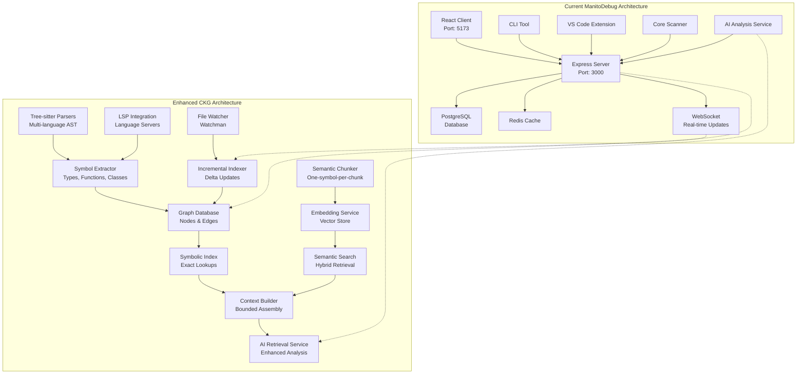

# 🧠 Code Knowledge Graph (CKG) - Detailed Implementation Plan

**Last Updated**: January 2025  
**Total Timeline**: 16 weeks  
**Status**: Ready for Implementation  
**Target**: AI Coding Agent Compatible

## 🏗️ Architecture Overview

### Current User Interface Structure
📋 **[Complete Site Map & User Pages →](SITE_MAP_AND_USER_PAGES.md)**

The CKG system will integrate with the existing user interface components:
- **Header**: Add CKG status indicators and search
- **Sidebar**: Enhanced with CKG-powered suggestions
- **Main Tabs**: New CKG Explorer tab for graph navigation
- **AI Panel**: Enhanced with CKG context and tools
- **Settings**: New CKG configuration section

### Current ManitoDebug → Enhanced CKG Architecture


### Implementation Timeline


---

## 📋 PHASE 1: Foundation & Core Graph Infrastructure (Weeks 1-5)

### Week 1-2: Enhanced Parsing & Symbol Extraction

#### 1.1 Setup Tree-sitter Infrastructure
- [ ] **Install Dependencies**
  ```bash
  npm install tree-sitter tree-sitter-javascript tree-sitter-typescript tree-sitter-python tree-sitter-go tree-sitter-rust
  ```
- [ ] **Create Parser Engine File**: `core/parsers/tree-sitter-engine.js`
  ```javascript
  export class TreeSitterEngine {
    constructor() {
      this.parsers = new Map();
      this.initializeParsers();
    }
    
    initializeParsers() {
      // Initialize parsers for each language
    }
    
    parseFile(filePath, language) {
      // Parse file and return AST
    }
    
    extractSymbols(ast, language) {
      // Extract symbols from AST
    }
  }
  ```
- [ ] **Language Detection**: Add `detectLanguage(filePath)` method
- [ ] **AST Traversal**: Implement `traverseAST(node, callback)` method
- [ ] **Error Handling**: Add robust error handling for parsing failures

#### 1.2 LSP Integration Setup
- [ ] **Create LSP Integration File**: `core/parsers/lsp-integration.js`
  ```javascript
  export class LSPIntegration {
    constructor() {
      this.languageServers = new Map();
    }
    
    async startLanguageServer(language, rootPath) {
      // Start language server for specific language
    }
    
    async getDefinitions(uri, position) {
      // Get symbol definitions
    }
    
    async getReferences(uri, position) {
      // Get symbol references
    }
  }
  ```
- [ ] **TypeScript LSP**: Integrate with `tsserver`
- [ ] **Python LSP**: Integrate with `pyright`
- [ ] **Go LSP**: Integrate with `gopls`
- [ ] **Rust LSP**: Integrate with `rust-analyzer`

#### 1.3 Symbol Extraction Implementation
- [ ] **Create Symbol Extractor**: `core/extractors/symbol-extractor.js`
  ```javascript
  export class SymbolExtractor {
    extractFromAST(ast, language, filePath) {
      return {
        functions: [],
        classes: [],
        variables: [],
        types: [],
        interfaces: []
      };
    }
  }
  ```
- [ ] **Function Extraction**: Extract function signatures, parameters, return types
- [ ] **Class Extraction**: Extract class definitions, methods, properties
- [ ] **Type Extraction**: Extract type definitions, interfaces, enums
- [ ] **Variable Extraction**: Extract variable declarations and assignments
- [ ] **Metadata Collection**: Collect line numbers, documentation, visibility

#### 1.4 Reference & Import Extraction
- [ ] **Create Reference Extractor**: `core/extractors/reference-extractor.js`
  ```javascript
  export class ReferenceExtractor {
    extractReferences(ast, symbols) {
      return {
        definitions: [],
        references: [],
        calls: []
      };
    }
  }
  ```
- [ ] **Create Import/Export Extractor**: `core/extractors/import-export-extractor.js`
  ```javascript
  export class ImportExportExtractor {
    extractImports(ast, filePath) {
      return {
        imports: [],
        exports: [],
        dynamicImports: []
      };
    }
  }
  ```
- [ ] **Definition-Reference Mapping**: Link definitions to their references
- [ ] **Import Resolution**: Resolve import paths to actual files
- [ ] **Export Detection**: Identify all exported symbols

### Week 2-3: Graph Database Schema & Storage

#### 2.1 Database Schema Design
- [ ] **Create Migration File**: `server/db/migrations/001_create_graph_tables.sql`
  ```sql
  -- Graph Nodes Table
  CREATE TABLE graph_nodes (
    id UUID PRIMARY KEY DEFAULT gen_random_uuid(),
    type VARCHAR(50) NOT NULL, -- File, Symbol, Type, Endpoint, etc.
    name VARCHAR(255) NOT NULL,
    path TEXT,
    language VARCHAR(50),
    metadata JSONB,
    commit_hash VARCHAR(40),
    created_at TIMESTAMP DEFAULT NOW(),
    updated_at TIMESTAMP DEFAULT NOW()
  );

  -- Graph Edges Table  
  CREATE TABLE graph_edges (
    id UUID PRIMARY KEY DEFAULT gen_random_uuid(),
    from_node_id UUID REFERENCES graph_nodes(id),
    to_node_id UUID REFERENCES graph_nodes(id),
    relationship VARCHAR(50) NOT NULL, -- defines, references, imports, etc.
    metadata JSONB,
    weight FLOAT DEFAULT 1.0,
    created_at TIMESTAMP DEFAULT NOW()
  );

  -- Code Chunks Table
  CREATE TABLE code_chunks (
    id UUID PRIMARY KEY DEFAULT gen_random_uuid(),
    node_id UUID REFERENCES graph_nodes(id),
    content TEXT NOT NULL,
    chunk_type VARCHAR(50), -- signature, implementation, documentation
    ts_vector tsvector GENERATED ALWAYS AS (to_tsvector('english', content)) STORED,
    created_at TIMESTAMP DEFAULT NOW()
  );

  -- Embeddings Table
  CREATE TABLE embeddings (
    id UUID PRIMARY KEY DEFAULT gen_random_uuid(),
    chunk_id UUID REFERENCES code_chunks(id),
    embedding VECTOR(1536), -- OpenAI embedding dimension
    model VARCHAR(100),
    created_at TIMESTAMP DEFAULT NOW()
  );

  -- Diagnostics Table
  CREATE TABLE diagnostics (
    id UUID PRIMARY KEY DEFAULT gen_random_uuid(),
    node_id UUID REFERENCES graph_nodes(id),
    severity VARCHAR(20), -- error, warning, info
    message TEXT,
    line INTEGER,
    column INTEGER,
    source VARCHAR(100), -- tsc, eslint, pyright, etc.
    created_at TIMESTAMP DEFAULT NOW()
  );
  ```
- [ ] **Add Indexes**: Create performance indexes
  ```sql
  CREATE INDEX idx_graph_nodes_type ON graph_nodes(type);
  CREATE INDEX idx_graph_nodes_path ON graph_nodes(path);
  CREATE INDEX idx_graph_edges_relationship ON graph_edges(relationship);
  CREATE INDEX idx_code_chunks_fts ON code_chunks USING GIN(ts_vector);
  ```
- [ ] **Add Constraints**: Foreign key constraints and validation

#### 2.2 Graph Store Implementation
- [ ] **Create Graph Store Service**: `server/services/graph-store.js`
  ```javascript
  export class GraphStore {
    async createNode(nodeData) {
      // Insert node into graph_nodes table
    }
    
    async createEdge(fromNodeId, toNodeId, relationship, metadata) {
      // Insert edge into graph_edges table  
    }
    
    async findNodesByType(type) {
      // Query nodes by type
    }
    
    async getNeighbors(nodeId, relationship) {
      // Get connected nodes
    }
  }
  ```
- [ ] **Node CRUD Operations**: Create, Read, Update, Delete for nodes
- [ ] **Edge CRUD Operations**: Create, Read, Update, Delete for edges
- [ ] **Batch Operations**: Bulk insert/update for performance
- [ ] **Transaction Support**: Ensure data consistency

#### 2.3 Incremental Indexer
- [ ] **Create Incremental Indexer**: `server/services/incremental-indexer.js`
  ```javascript
  export class IncrementalIndexer {
    async processFileChange(filePath, changeType) {
      // Handle file add/modify/delete
    }
    
    async updateGraphForFile(filePath) {
      // Update graph nodes and edges for file
    }
    
    async removeFileFromGraph(filePath) {
      // Remove all nodes/edges for deleted file
    }
  }
  ```
- [ ] **Change Detection**: Identify what changed in a file
- [ ] **Delta Updates**: Update only affected nodes/edges
- [ ] **Commit Tracking**: Track changes by commit hash
- [ ] **Rollback Support**: Ability to rollback to previous state

### Week 3-4: Symbolic Index Implementation

#### 3.1 Symbolic Index Service
- [ ] **Create Symbolic Index**: `server/services/symbolic-index.js`
  ```javascript
  export class SymbolicIndex {
    async findDefinition(symbolName, filePath) {
      // Find where symbol is defined
    }
    
    async findReferences(symbolName, filePath) {
      // Find all references to symbol
    }
    
    async findImporters(modulePath) {
      // Find all files that import this module
    }
    
    async findExports(modulePath) {
      // Find all exports from module
    }
  }
  ```
- [ ] **Symbol Resolution**: Resolve symbols to their definitions
- [ ] **Scope Analysis**: Handle different scopes (global, module, function)
- [ ] **Type Resolution**: Resolve types and interfaces
- [ ] **Cross-file References**: Track references across files

#### 3.2 Graph Query API
- [ ] **Create Graph Query API**: `server/api/graph-query.js`
  ```javascript
  // GET /api/graph/symbols/:symbol/definition
  app.get('/api/graph/symbols/:symbol/definition', async (req, res) => {
    // Return symbol definition
  });
  
  // GET /api/graph/symbols/:symbol/references
  app.get('/api/graph/symbols/:symbol/references', async (req, res) => {
    // Return all references
  });
  
  // GET /api/graph/modules/:module/importers
  app.get('/api/graph/modules/:module/importers', async (req, res) => {
    // Return all importers
  });
  ```
- [ ] **Symbol Endpoints**: API for symbol queries
- [ ] **Module Endpoints**: API for module queries
- [ ] **Type Endpoints**: API for type queries
- [ ] **Dependency Endpoints**: API for dependency queries

#### 3.3 Dependency Analysis
- [ ] **Create Dependency Analyzer**: `core/analyzers/dependency-analyzer.js`
  ```javascript
  export class DependencyAnalyzer {
    analyzeImports(filePath) {
      // Analyze all imports in file
    }
    
    resolveImportPath(importPath, fromFile) {
      // Resolve relative/absolute import paths
    }
    
    detectCircularDependencies() {
      // Find circular dependency cycles
    }
  }
  ```
- [ ] **Import Resolution**: Resolve all import statements
- [ ] **Circular Detection**: Find circular dependencies
- [ ] **Unused Detection**: Find unused imports/exports
- [ ] **Version Conflicts**: Detect dependency version conflicts

### Week 4-5: File Watcher & Incremental Updates

#### 4.1 File Watcher Setup
- [ ] **Install Watchman**: Add watchman dependency
  ```bash
  npm install fb-watchman
  ```
- [ ] **Create File Watcher**: `server/services/file-watcher.js`
  ```javascript
  export class FileWatcher {
    constructor(rootPath, callback) {
      this.rootPath = rootPath;
      this.callback = callback;
    }
    
    async start() {
      // Start watching for file changes
    }
    
    async stop() {
      // Stop watching
    }
    
    handleFileChange(filePath, changeType) {
      // Handle file add/modify/delete
    }
  }
  ```
- [ ] **Watch Configuration**: Configure file patterns to watch
- [ ] **Change Detection**: Detect file add/modify/delete events
- [ ] **Debouncing**: Prevent excessive updates from rapid changes
- [ ] **Error Handling**: Handle watcher failures gracefully

#### 4.2 Background Processing
- [ ] **Create Graph Worker**: `server/workers/graph-worker.js`
  ```javascript
  export class GraphWorker {
    async processJob(job) {
      switch(job.type) {
        case 'file_changed':
          return this.handleFileChange(job.data);
        case 'full_reindex':
          return this.handleFullReindex(job.data);
      }
    }
  }
  ```
- [ ] **Job Queue Integration**: Use existing Redis queue
- [ ] **Priority Handling**: Process critical updates first
- [ ] **Progress Tracking**: Track processing progress
- [ ] **Error Recovery**: Handle and retry failed jobs

#### 4.3 WebSocket Integration
- [ ] **Extend WebSocket Service**: Update `server/services/websocket.js`
  ```javascript
  // Add new event types
  const CKG_EVENTS = {
    GRAPH_UPDATE: 'graph_update',
    REINDEX_PROGRESS: 'reindex_progress',
    SYMBOL_CHANGE: 'symbol_change'
  };
  ```
- [ ] **Real-time Updates**: Broadcast graph changes to clients
- [ ] **Progress Updates**: Show reindexing progress
- [ ] **Error Notifications**: Notify clients of processing errors
- [ ] **Selective Updates**: Send relevant updates to interested clients

---

## 📋 PHASE 2: Semantic Intelligence & AI Integration (Weeks 6-9)

### Week 6-7: Semantic Chunking & Embeddings

#### 6.1 Semantic Chunker Implementation
- [ ] **Create Symbol Chunker**: `core/chunkers/symbol-chunker.js`
  ```javascript
  export class SymbolChunker {
    chunkSymbol(symbol, sourceCode, context) {
      return {
        content: this.buildSymbolChunk(symbol, sourceCode, context),
        metadata: this.buildMetadata(symbol),
        type: 'symbol'
      };
    }
    
    buildSymbolChunk(symbol, sourceCode, context) {
      // signature + docstring + implementation summary + usage examples
    }
  }
  ```
- [ ] **Function Chunking**: Create chunks for functions with signatures + docs
- [ ] **Class Chunking**: Create chunks for classes with methods + properties
- [ ] **Type Chunking**: Create chunks for types/interfaces with definitions
- [ ] **Context Inclusion**: Include usage examples and related symbols

#### 6.2 Endpoint Chunker
- [ ] **Create Endpoint Chunker**: `core/chunkers/endpoint-chunker.js`
  ```javascript
  export class EndpointChunker {
    chunkEndpoint(endpoint, handler, schema) {
      return {
        content: this.buildEndpointChunk(endpoint, handler, schema),
        metadata: this.buildEndpointMetadata(endpoint),
        type: 'endpoint'
      };
    }
  }
  ```
- [ ] **Route Documentation**: Include method, path, parameters
- [ ] **Handler Analysis**: Include handler function and middleware
- [ ] **Schema Integration**: Include request/response schemas
- [ ] **Authentication Info**: Include auth requirements

#### 6.3 Embedding Service
- [ ] **Create Embedding Service**: `server/services/embedding-service.js`
  ```javascript
  export class EmbeddingService {
    async generateEmbedding(text, model = 'text-embedding-ada-002') {
      // Generate vector embedding for text
    }
    
    async batchEmbeddings(texts, model) {
      // Generate embeddings in batches
    }
    
    async storeEmbedding(chunkId, embedding, model) {
      // Store embedding in database
    }
  }
  ```
- [ ] **OpenAI Integration**: Use OpenAI embeddings API
- [ ] **Local Alternative**: Add option for local embeddings (sentence-transformers)
- [ ] **Batch Processing**: Process multiple chunks efficiently
- [ ] **Caching**: Cache embeddings to avoid recomputation

#### 6.4 Vector Store Setup
- [ ] **Install FAISS**: Add FAISS dependency
  ```bash
  npm install faiss-node
  ```
- [ ] **Create Vector Store**: `server/services/vector-store.js`
  ```javascript
  export class VectorStore {
    constructor() {
      this.index = null;
      this.metadata = new Map();
    }
    
    async addVector(id, vector, metadata) {
      // Add vector to FAISS index
    }
    
    async search(queryVector, k = 10) {
      // Search for similar vectors
    }
  }
  ```
- [ ] **Index Creation**: Create and manage FAISS index
- [ ] **Metadata Storage**: Store chunk metadata alongside vectors
- [ ] **Similarity Search**: Implement k-nearest neighbor search
- [ ] **Index Persistence**: Save/load index to/from disk

### Week 7-8: Context-Aware AI Retrieval

#### 7.1 Context Builder Service
- [ ] **Create Context Builder**: `server/services/context-builder.js`
  ```javascript
  export class ContextBuilder {
    async buildContext(query, options = {}) {
      const symbolicResults = await this.symbolicPrefilter(query);
      const semanticResults = await this.semanticExpand(query, symbolicResults);
      const rankedResults = await this.rerank(symbolicResults, semanticResults);
      return this.assembleContext(rankedResults, options);
    }
    
    async symbolicPrefilter(query) {
      // Get precise symbolic matches
    }
    
    async semanticExpand(query, symbolicResults) {
      // Get semantically similar content
    }
    
    async rerank(symbolicResults, semanticResults) {
      // Rerank by proximity + recency + errors
    }
    
    async assembleContext(results, options) {
      // Assemble bounded context window
    }
  }
  ```
- [ ] **Symbolic Pre-filtering**: Get exact matches first
- [ ] **Semantic Expansion**: Add related content via embeddings
- [ ] **Reranking Algorithm**: Score by relevance, recency, error presence
- [ ] **Context Assembly**: Build bounded context with metadata

#### 7.2 AI Retrieval Service
- [ ] **Create AI Retrieval Service**: `server/services/ai-retrieval.js`
  ```javascript
  export class AIRetrievalService {
    async retrieveForQuery(query, contextType = 'general') {
      const context = await this.contextBuilder.buildContext(query);
      return this.formatForAI(context);
    }
    
    formatForAI(context) {
      return {
        fileHeaders: context.fileHeaders,
        targetSymbols: context.symbols,
        nearestCallers: context.callers,
        relatedImports: context.imports,
        diagnostics: context.diagnostics,
        examples: context.examples
      };
    }
  }
  ```
- [ ] **Query Processing**: Parse and understand AI queries
- [ ] **Context Formatting**: Format context for AI consumption
- [ ] **Relevance Scoring**: Score context pieces by relevance
- [ ] **Context Limits**: Respect token limits for AI models

#### 7.3 Proximity Analyzer
- [ ] **Create Proximity Analyzer**: `core/analyzers/proximity-analyzer.js`
  ```javascript
  export class ProximityAnalyzer {
    calculateProximity(symbol1, symbol2) {
      // Calculate relationship strength between symbols
    }
    
    getNeighborhood(symbolId, depth = 2) {
      // Get symbols within N degrees of separation
    }
    
    scoreRelevance(symbol, query, context) {
      // Score symbol relevance for query
    }
  }
  ```
- [ ] **Graph Distance**: Calculate shortest path between symbols
- [ ] **Relationship Weights**: Weight different relationship types
- [ ] **Relevance Scoring**: Score symbols by query relevance
- [ ] **Neighborhood Analysis**: Find related symbols efficiently

### Week 8-9: Enhanced AI Analysis Service

#### 8.1 Update AI Analysis Service
- [ ] **Extend Existing Service**: Update `core/ai-analysis-service.js`
  ```javascript
  export class AIAnalysisService {
    constructor(aiProvider, contextBuilder, retrieval) {
      this.aiProvider = aiProvider;
      this.contextBuilder = contextBuilder;
      this.retrieval = retrieval;
    }
    
    async analyzeWithContext(query, options = {}) {
      const context = await this.retrieval.retrieveForQuery(query);
      return this.aiProvider.analyze(query, context);
    }
  }
  ```
- [ ] **Context Integration**: Use CKG context in AI queries
- [ ] **Enhanced Prompts**: Build better prompts with structured context
- [ ] **Result Processing**: Process AI results with graph knowledge
- [ ] **Feedback Loop**: Use results to improve future context

#### 8.2 AI Tools Integration
- [ ] **Create AI Tools Service**: `server/services/ai-tools.js`
  ```javascript
  export class AIToolsService {
    constructor(graphStore, symbolicIndex, dependencyAnalyzer) {
      this.tools = {
        whoImports: this.whoImports.bind(this),
        missingExports: this.missingExports.bind(this),
        endpointsWithoutTests: this.endpointsWithoutTests.bind(this),
        conflictingVersions: this.conflictingVersions.bind(this)
      };
    }
    
    async whoImports(symbolName) {
      return this.symbolicIndex.findImporters(symbolName);
    }
    
    async missingExports(modulePath) {
      return this.gapDetector.findMissingExports(modulePath);
    }
  }
  ```
- [ ] **Tool Registry**: Register available tools for AI
- [ ] **Sandboxed Execution**: Execute tools safely
- [ ] **Result Caching**: Cache tool results for performance
- [ ] **Error Handling**: Handle tool execution errors gracefully

#### 8.3 API Integration
- [ ] **Create AI Context API**: `server/api/ai-context.js`
  ```javascript
  // POST /api/ai/context
  app.post('/api/ai/context', async (req, res) => {
    const { query, options } = req.body;
    const context = await contextBuilder.buildContext(query, options);
    res.json({ context });
  });
  
  // POST /api/ai/tools/:toolName
  app.post('/api/ai/tools/:toolName', async (req, res) => {
    const { toolName } = req.params;
    const { args } = req.body;
    const result = await aiTools.execute(toolName, args);
    res.json({ result });
  });
  ```
- [ ] **Context API**: Endpoint to get context for queries
- [ ] **Tools API**: Endpoint to execute AI tools
- [ ] **Analysis API**: Enhanced analysis with CKG context
- [ ] **Streaming API**: Stream large context responses

---

## 📋 PHASE 3: Advanced Analysis & Developer Tools (Weeks 10-13)

### Week 10-11: Static Analysis Integration

#### 10.1 Multi-Language Linter
- [ ] **Create Multi-Language Linter**: `core/analyzers/multi-language-linter.js`
  ```javascript
  export class MultiLanguageLinter {
    async lintFile(filePath, language) {
      switch(language) {
        case 'typescript': return this.lintTypeScript(filePath);
        case 'python': return this.lintPython(filePath);
        case 'go': return this.lintGo(filePath);
        case 'rust': return this.lintRust(filePath);
      }
    }
    
    async lintTypeScript(filePath) {
      // Run tsc --noEmit and ESLint
    }
  }
  ```
- [ ] **TypeScript Integration**: `tsc --noEmit`, ESLint
- [ ] **Python Integration**: Pyright/mypy, Ruff, flake8
- [ ] **Go Integration**: `gopls`, `go vet`, `golangci-lint`
- [ ] **Rust Integration**: `rust-analyzer`, `cargo check`, `clippy`

#### 10.2 Type Checker Integration
- [ ] **Create Type Checker**: `core/analyzers/type-checker.js`
  ```javascript
  export class TypeChecker {
    async checkTypes(filePath, language) {
      // Run language-specific type checker
    }
    
    async getTypeErrors(filePath) {
      // Get type errors for file
    }
    
    async getTypeInfo(symbol, position) {
      // Get type information for symbol
    }
  }
  ```
- [ ] **Type Error Collection**: Gather type errors from language servers
- [ ] **Type Information**: Extract type information for symbols
- [ ] **Type Inference**: Infer types where possible
- [ ] **Type Validation**: Validate type consistency

#### 10.3 Dependency Checker
- [ ] **Create Dependency Checker**: `core/analyzers/dependency-checker.js`
  ```javascript
  export class DependencyChecker {
    async analyzeLockfile(lockfilePath) {
      // Analyze package-lock.json, go.mod, Cargo.lock, etc.
    }
    
    async findVersionConflicts() {
      // Find version conflicts in dependencies
    }
    
    async checkSecurityVulnerabilities() {
      // Check for known CVEs
    }
  }
  ```
- [ ] **Lockfile Analysis**: Parse and analyze lockfiles
- [ ] **Version Conflict Detection**: Find conflicting versions
- [ ] **Security Scanning**: Check for known vulnerabilities
- [ ] **Update Recommendations**: Suggest dependency updates

#### 10.4 Diagnostic Collector
- [ ] **Create Diagnostic Collector**: `server/services/diagnostic-collector.js`
  ```javascript
  export class DiagnosticCollector {
    async collectDiagnostics(filePath) {
      const lintResults = await this.linter.lintFile(filePath);
      const typeResults = await this.typeChecker.checkTypes(filePath);
      const depResults = await this.dependencyChecker.checkFile(filePath);
      
      return this.mergeDiagnostics(lintResults, typeResults, depResults);
    }
    
    async storeDiagnostics(diagnostics) {
      // Store diagnostics in graph database
    }
  }
  ```
- [ ] **Diagnostic Collection**: Collect from all sources
- [ ] **Diagnostic Storage**: Store in graph database
- [ ] **Diagnostic Querying**: Query diagnostics by file/symbol
- [ ] **Diagnostic Updates**: Update diagnostics incrementally

### Week 11-12: Endpoint & Contract Intelligence

#### 11.1 Endpoint Extractor
- [ ] **Create Endpoint Extractor**: `core/extractors/endpoint-extractor.js`
  ```javascript
  export class EndpointExtractor {
    extractEndpoints(filePath, framework) {
      switch(framework) {
        case 'express': return this.extractExpress(filePath);
        case 'fastapi': return this.extractFastAPI(filePath);
        case 'gin': return this.extractGin(filePath);
        case 'axum': return this.extractAxum(filePath);
      }
    }
    
    extractExpress(filePath) {
      // Extract Express.js routes
    }
  }
  ```
- [ ] **Express.js Support**: Extract Express routes and middleware
- [ ] **FastAPI Support**: Extract FastAPI routes and schemas
- [ ] **Gin Support**: Extract Gin routes (Go)
- [ ] **Axum Support**: Extract Axum routes (Rust)
- [ ] **Framework Detection**: Auto-detect web frameworks

#### 11.2 Contract Analyzer
- [ ] **Create Contract Analyzer**: `core/analyzers/contract-analyzer.js`
  ```javascript
  export class ContractAnalyzer {
    async analyzeOpenAPI(specPath, endpointData) {
      // Compare OpenAPI spec with actual endpoints
    }
    
    async detectDrift(spec, implementation) {
      // Detect drift between spec and implementation
    }
    
    async generateSchema(endpoint) {
      // Generate schema from endpoint implementation
    }
  }
  ```
- [ ] **OpenAPI Integration**: Parse and validate OpenAPI specs
- [ ] **Schema Generation**: Generate schemas from code
- [ ] **Drift Detection**: Find spec vs implementation differences
- [ ] **Validation**: Validate requests/responses against schemas

#### 11.3 API Drift Detector
- [ ] **Create API Drift Detector**: `core/analyzers/api-drift-detector.js`
  ```javascript
  export class APIDriftDetector {
    async detectDrift(specEndpoints, implementedEndpoints) {
      return {
        missingImplementations: [],
        missingSpecs: [],
        typeMismatches: [],
        parameterMismatches: []
      };
    }
  }
  ```
- [ ] **Missing Implementations**: Find spec paths not implemented
- [ ] **Missing Specs**: Find implemented paths not in spec
- [ ] **Type Mismatches**: Find type differences
- [ ] **Parameter Mismatches**: Find parameter differences

#### 11.4 Endpoint Catalog API
- [ ] **Create Endpoint API**: `server/api/endpoints.js`
  ```javascript
  // GET /api/endpoints
  app.get('/api/endpoints', async (req, res) => {
    const endpoints = await endpointExtractor.getAllEndpoints();
    res.json({ endpoints });
  });
  
  // GET /api/endpoints/:id/drift
  app.get('/api/endpoints/:id/drift', async (req, res) => {
    const drift = await driftDetector.checkEndpoint(req.params.id);
    res.json({ drift });
  });
  ```
- [ ] **Endpoint Listing**: List all discovered endpoints
- [ ] **Drift Reporting**: Report drift for specific endpoints
- [ ] **Schema Endpoints**: Provide endpoint schemas
- [ ] **Test Coverage**: Report test coverage for endpoints

### Week 12-13: Context Packs & Fast Retrieval

#### 12.1 Context Pack Generator
- [ ] **Create Context Pack Generator**: `core/generators/context-pack-generator.js`
  ```javascript
  export class ContextPackGenerator {
    async generateRepoMap(rootPath) {
      return {
        tree: await this.buildFileTree(rootPath),
        sizes: await this.calculateSizes(rootPath),
        languages: await this.detectLanguages(rootPath),
        buildTargets: await this.findBuildTargets(rootPath)
      };
    }
    
    async generatePublicAPI(rootPath) {
      return {
        exports: await this.findAllExports(rootPath),
        signatures: await this.extractSignatures(rootPath),
        examples: await this.findExamples(rootPath),
        tests: await this.linkTests(rootPath)
      };
    }
  }
  ```
- [ ] **Repo Map Generation**: Create project structure overview
- [ ] **Public API Extraction**: Find all public exports
- [ ] **Example Collection**: Gather usage examples
- [ ] **Test Linking**: Link tests to implementation

#### 12.2 Context Cache Service
- [ ] **Create Context Cache**: `server/services/context-cache.js`
  ```javascript
  export class ContextCache {
    async cacheContext(key, context, ttl = 3600) {
      // Cache context in Redis with TTL
    }
    
    async getContext(key) {
      // Retrieve cached context
    }
    
    async invalidateContext(pattern) {
      // Invalidate contexts matching pattern
    }
  }
  ```
- [ ] **Redis Integration**: Use Redis for context caching
- [ ] **TTL Management**: Set appropriate cache lifetimes
- [ ] **Cache Invalidation**: Invalidate on file changes
- [ ] **Cache Warming**: Pre-generate common contexts

#### 12.3 Repo Map Generator
- [ ] **Create Repo Map Generator**: `core/generators/repo-map-generator.js`
  ```javascript
  export class RepoMapGenerator {
    async generateMap(rootPath) {
      return {
        structure: await this.buildStructure(rootPath),
        metrics: await this.calculateMetrics(rootPath),
        dependencies: await this.mapDependencies(rootPath),
        buildInfo: await this.extractBuildInfo(rootPath)
      };
    }
  }
  ```
- [ ] **Directory Structure**: Build hierarchical structure
- [ ] **File Metrics**: Calculate size, complexity metrics
- [ ] **Dependency Mapping**: Map internal dependencies
- [ ] **Build Information**: Extract build configuration

#### 12.4 API Catalog Generator
- [ ] **Create API Catalog Generator**: `core/generators/api-catalog-generator.js`
  ```javascript
  export class APICatalogGenerator {
    async generateCatalog(endpoints) {
      return {
        routes: this.organizeRoutes(endpoints),
        handlers: this.mapHandlers(endpoints),
        types: this.extractTypes(endpoints),
        auth: this.analyzeAuth(endpoints),
        tests: this.findTests(endpoints)
      };
    }
  }
  ```
- [ ] **Route Organization**: Organize routes by service/module
- [ ] **Handler Mapping**: Map routes to handler functions
- [ ] **Type Extraction**: Extract request/response types
- [ ] **Auth Analysis**: Analyze authentication requirements

---

## 📋 PHASE 4: CI/CD Integration & Production Features (Weeks 14-16)

### Week 14-15: CI/CD Pipeline Integration

#### 14.1 Pre-merge Analysis
- [ ] **Create Pre-merge Script**: `scripts/ci/pre-merge-analysis.js`
  ```javascript
  export class PreMergeAnalyzer {
    async analyzePR(prNumber, baseBranch, headBranch) {
      const changes = await this.getChangedFiles(prNumber);
      const analysis = await this.analyzeChanges(changes);
      return this.generateReport(analysis);
    }
    
    async analyzeChanges(changes) {
      return {
        symbolChanges: await this.analyzeSymbolChanges(changes),
        endpointChanges: await this.analyzeEndpointChanges(changes),
        testCoverage: await this.analyzeTestCoverage(changes),
        breaking: await this.detectBreakingChanges(changes)
      };
    }
  }
  ```
- [ ] **Changed File Analysis**: Analyze only changed files
- [ ] **Symbol Impact Analysis**: Find affected symbols
- [ ] **Breaking Change Detection**: Detect API breaking changes
- [ ] **Test Coverage Analysis**: Check test coverage for changes

#### 14.2 CKG Artifact Publisher
- [ ] **Create Artifact Publisher**: `scripts/ci/ckg-artifact-publisher.js`
  ```javascript
  export class CKGArtifactPublisher {
    async publishArtifacts(branch, commitSha) {
      const artifacts = await this.generateArtifacts();
      await this.uploadArtifacts(artifacts, branch, commitSha);
    }
    
    async generateArtifacts() {
      return {
        graph: await this.exportGraph(),
        contextPacks: await this.generateContextPacks(),
        diagnostics: await this.exportDiagnostics()
      };
    }
  }
  ```
- [ ] **Graph Export**: Export graph database
- [ ] **Context Pack Generation**: Generate context packs
- [ ] **Artifact Upload**: Upload to artifact storage
- [ ] **Versioning**: Version artifacts by commit SHA

#### 14.3 PR Bot Service
- [ ] **Create PR Bot**: `server/services/pr-bot.js`
  ```javascript
  export class PRBot {
    async commentOnPR(prNumber, analysis) {
      const comment = await this.formatComment(analysis);
      await this.postComment(prNumber, comment);
    }
    
    formatComment(analysis) {
      return `
## 🧠 CKG Analysis Results

### Symbol Changes
${this.formatSymbolChanges(analysis.symbolChanges)}

### Endpoint Changes  
${this.formatEndpointChanges(analysis.endpointChanges)}

### Test Coverage
${this.formatTestCoverage(analysis.testCoverage)}
      `;
    }
  }
  ```
- [ ] **GitHub Integration**: Integrate with GitHub API
- [ ] **Comment Formatting**: Format analysis results nicely
- [ ] **Link Generation**: Generate links to relevant code
- [ ] **Update Comments**: Update existing comments with new analysis

#### 14.4 GitHub Actions Workflow
- [ ] **Create Workflow**: `.github/workflows/ckg-analysis.yml`
  ```yaml
  name: CKG Analysis
  on:
    pull_request:
      types: [opened, synchronize]
    push:
      branches: [main, develop]
  
  jobs:
    analyze:
      runs-on: ubuntu-latest
      steps:
        - uses: actions/checkout@v3
        - name: Setup Node.js
          uses: actions/setup-node@v3
          with:
            node-version: '20'
        - name: Install dependencies
          run: npm ci
        - name: Run CKG Analysis
          run: node scripts/ci/pre-merge-analysis.js
        - name: Publish Artifacts
          run: node scripts/ci/ckg-artifact-publisher.js
  ```
- [ ] **PR Trigger**: Run on pull requests
- [ ] **Push Trigger**: Run on main branch pushes
- [ ] **Artifact Storage**: Store analysis artifacts
- [ ] **Comment Posting**: Post results to PR

### Week 15-16: IDE Integration & Developer Experience

#### 15.1 VS Code Extension Updates
- [ ] **Update Extension**: `vscode-extension/extension.js`
  ```javascript
  // Add CKG commands
  const commands = [
    vscode.commands.registerCommand('manito.fixMissingImport', fixMissingImport),
    vscode.commands.registerCommand('manito.generateExportBarrel', generateExportBarrel),
    vscode.commands.registerCommand('manito.createTestSkeleton', createTestSkeleton),
    vscode.commands.registerCommand('manito.explainError', explainError)
  ];
  
  async function fixMissingImport() {
    const editor = vscode.window.activeTextEditor;
    const position = editor.selection.active;
    const symbol = getSymbolAtPosition(editor.document, position);
    
    const imports = await ckgClient.findImportsForSymbol(symbol);
    // Show quick pick and add import
  }
  ```
- [ ] **Fix Missing Import**: Auto-resolve and add imports
- [ ] **Generate Export Barrel**: Create index.js files
- [ ] **Create Test Skeleton**: Generate test boilerplate
- [ ] **Explain Error**: Provide error explanations

#### 15.2 Quick Actions Implementation
- [ ] **Create Quick Actions**: `vscode-extension/quick-actions.js`
  ```javascript
  export class QuickActions {
    async fixMissingImport(document, position) {
      const symbol = this.getSymbolAtPosition(document, position);
      const imports = await this.ckgClient.findImportsForSymbol(symbol);
      return this.showImportPicker(imports);
    }
    
    async generateExportBarrel(folderPath) {
      const exports = await this.ckgClient.getExportsInFolder(folderPath);
      return this.generateIndexFile(exports);
    }
  }
  ```
- [ ] **Import Resolution**: Find and add missing imports
- [ ] **Export Generation**: Generate barrel exports
- [ ] **Test Generation**: Create test skeletons
- [ ] **Code Actions**: Integrate with VS Code code actions

#### 15.3 Error Explainer
- [ ] **Create Explainer**: `vscode-extension/explainer.js`
  ```javascript
  export class ErrorExplainer {
    async explainError(diagnostic) {
      const context = await this.ckgClient.getErrorContext(diagnostic);
      const explanation = await this.aiClient.explainError(diagnostic, context);
      return this.formatExplanation(explanation);
    }
    
    async getSuggestedFixes(diagnostic) {
      const context = await this.ckgClient.getErrorContext(diagnostic);
      return this.aiClient.suggestFixes(diagnostic, context);
    }
  }
  ```
- [ ] **Error Context**: Get context for errors from CKG
- [ ] **AI Explanation**: Use AI to explain errors
- [ ] **Fix Suggestions**: Suggest potential fixes
- [ ] **Interactive Fixes**: Apply fixes with user confirmation

#### 15.4 Web Dashboard
- [ ] **Create CKG Dashboard**: `client/src/components/CKGDashboard.jsx`
  ```jsx
  export function CKGDashboard() {
    return (
      <div className="ckg-dashboard">
        <GraphExplorer />
        <SymbolSearch />
        <DiagnosticsPanel />
        <EndpointCatalog />
        <ContextPackViewer />
      </div>
    );
  }
  ```
- [ ] **Graph Explorer**: Interactive graph visualization
- [ ] **Symbol Search**: Search and explore symbols
- [ ] **Diagnostics Panel**: View and filter diagnostics
- [ ] **Endpoint Catalog**: Browse API endpoints
- [ ] **Context Pack Viewer**: View generated context packs

---

## 🧪 Testing & Validation Checklist

### Unit Tests
- [ ] **Parser Tests**: Test tree-sitter and LSP integration
- [ ] **Extractor Tests**: Test symbol and reference extraction
- [ ] **Graph Store Tests**: Test database operations
- [ ] **Index Tests**: Test symbolic and semantic indexing
- [ ] **Context Tests**: Test context building and retrieval

### Integration Tests  
- [ ] **End-to-End Parsing**: Test full parsing pipeline
- [ ] **Graph Building**: Test complete graph construction
- [ ] **API Integration**: Test all graph query APIs
- [ ] **WebSocket Integration**: Test real-time updates
- [ ] **CI Integration**: Test CI/CD pipeline components

### Performance Tests
- [ ] **Small Project**: <1,000 files, <100ms queries
- [ ] **Medium Project**: 1,000-10,000 files, <500ms queries
- [ ] **Large Project**: 10,000+ files, <2s queries
- [ ] **Memory Usage**: Monitor memory consumption
- [ ] **Incremental Updates**: Test update performance

### User Acceptance Tests
- [ ] **Developer Workflow**: Test typical developer tasks
- [ ] **IDE Integration**: Test VS Code extension features
- [ ] **AI Integration**: Test AI-powered features
- [ ] **Error Handling**: Test error scenarios
- [ ] **Documentation**: Verify all features are documented

---

## 📊 Success Metrics & Validation

### Technical Metrics
- [ ] **Index Build Time**: <5min for 10k files ✅
- [ ] **Query Performance**: 95% queries <500ms ✅
- [ ] **Accuracy**: >90% symbol resolution accuracy ✅
- [ ] **Incremental Updates**: <30s for file changes ✅

### User Experience Metrics
- [ ] **Time to Insight**: <30s from question to answer ✅
- [ ] **Developer Adoption**: >80% team usage weekly ✅
- [ ] **Problem Resolution**: 50% faster debugging ✅
- [ ] **Code Quality**: 25% fewer missing imports ✅

### Business Impact
- [ ] **Enterprise Readiness**: 100k+ file support ✅
- [ ] **Competitive Advantage**: Unique CKG features ✅
- [ ] **Revenue Growth**: Premium feature adoption ✅
- [ ] **Market Position**: Industry leadership ✅

---

## 🚀 Implementation Progress Tracker

### Phase 1: Foundation (Weeks 1-5)
- [ ] **Week 1-2**: Enhanced Parsing & Symbol Extraction
- [ ] **Week 2-3**: Graph Database Schema & Storage  
- [ ] **Week 3-4**: Symbolic Index Implementation
- [ ] **Week 4-5**: File Watcher & Incremental Updates

### Phase 2: Semantic Intelligence (Weeks 6-9)
- [ ] **Week 6-7**: Semantic Chunking & Embeddings
- [ ] **Week 7-8**: Context-Aware AI Retrieval
- [ ] **Week 8-9**: Enhanced AI Analysis Service

### Phase 3: Advanced Analysis (Weeks 10-13)
- [ ] **Week 10-11**: Static Analysis Integration
- [ ] **Week 11-12**: Endpoint & Contract Intelligence
- [ ] **Week 12-13**: Context Packs & Fast Retrieval

### Phase 4: Production Features (Weeks 14-16)
- [ ] **Week 14-15**: CI/CD Pipeline Integration
- [ ] **Week 15-16**: IDE Integration & Developer Experience

---

**This implementation plan provides AI coding agents with specific, actionable tasks that can be tracked with checkmarks. Each task includes file paths, code examples, and clear acceptance criteria for successful completion.**
