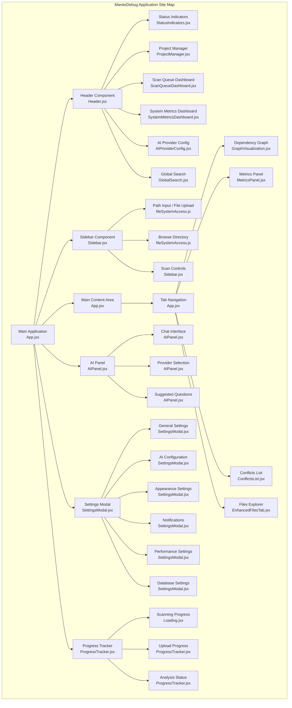
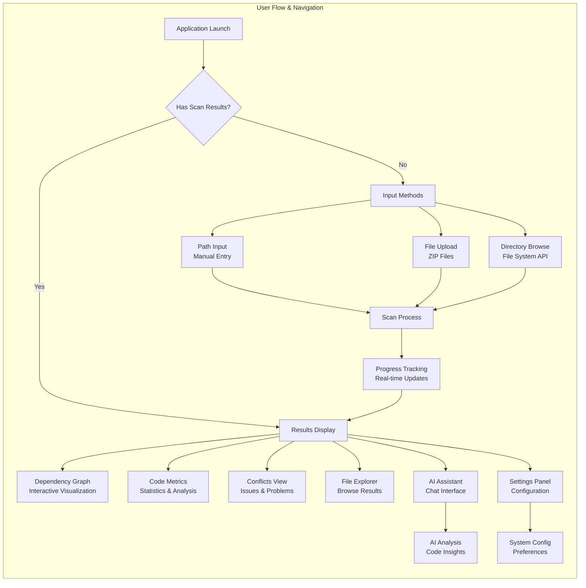

# 🗺️ ManitoDebug Site Map & User-Facing Pages

**Last Updated**: January 2025  
**Purpose**: Complete visual guide to user-facing components and file structure  
**Target**: Development team and stakeholders

## 📊 Visual Site Map

### Application Architecture Overview


### User Flow & Navigation


---

## 📱 User-Facing Pages & Components

### 1. **Main Application** (`App.jsx`)
**Route**: `/` (Single Page Application)  
**Status**: ✅ Active  
**Purpose**: Primary application container and state management

#### **File Details**:
- **Location**: `client/src/App.jsx`
- **Lines**: 625 lines
- **Dependencies**: React Query, Lucide React, Custom components
- **State Management**: React hooks, Context providers

#### **Key Features**:
- [ ] **Application State**: Manages scanning state, results, UI modes
- [ ] **Port Configuration**: Dynamic port management integration
- [ ] **WebSocket Integration**: Real-time updates and progress tracking
- [ ] **Keyboard Shortcuts**: 
  - `Cmd/Ctrl + ,` → Open Settings
  - `Alt + A` → Toggle AI Panel
  - `Cmd/Ctrl + Enter` → Start Scan
- [ ] **Tab Navigation**: Graph, Metrics, Conflicts, Files tabs

#### **Child Components**:
- Header, Sidebar, Main Content Area
- AIPanel, SettingsModal, ProgressTracker
- GraphVisualization, MetricsPanel, ConflictsList, EnhancedFilesTab

---

### 2. **Header Component** (`Header.jsx`)
**Route**: Global header (always visible)  
**Status**: ✅ Active  
**Purpose**: Application header with controls and status indicators

#### **File Details**:
- **Location**: `client/src/components/Header.jsx`
- **Lines**: 105 lines
- **Dependencies**: Lucide React, Custom components

#### **Key Features**:
- [ ] **App Branding**: ManitoDebug logo and title
- [ ] **Status Indicators**: Connection, health, system status
- [ ] **Project Manager**: Project selection and management
- [ ] **Scan Queue Dashboard**: Queue monitoring
- [ ] **System Metrics Dashboard**: Real-time system metrics
- [ ] **AI Provider Config**: AI service configuration
- [ ] **Global Search**: Search across results
- [ ] **AI Assistant Button**: Toggle AI panel
- [ ] **Settings Button**: Open settings modal
- [ ] **Toast Notifications**: Test notification system

#### **Sub-Components**:
- `StatusIndicators.jsx` - System status display
- `ProjectManager.jsx` - Project management interface
- `ScanQueueDashboard.jsx` - Queue monitoring
- `SystemMetricsDashboard.jsx` - System metrics
- `AIProviderConfig.jsx` - AI configuration
- `GlobalSearch.jsx` - Search interface

---

### 3. **Sidebar Component** (`Sidebar.jsx`)
**Route**: Left sidebar (always visible)  
**Status**: ✅ Active  
**Purpose**: Input methods and scan controls

#### **File Details**:
- **Location**: `client/src/components/Sidebar.jsx`
- **Lines**: 400+ lines (estimated from imports)
- **Dependencies**: File System Access API, Lucide React

#### **Key Features**:
- [ ] **Input Mode Selection**:
  - Path input (manual entry)
  - File upload (ZIP files)
  - Directory browsing (File System API)
- [ ] **Drag & Drop**: File upload via drag and drop
- [ ] **Path Validation**: Real-time path validation
- [ ] **Scan Controls**: Start/stop scanning
- [ ] **Upload Progress**: File upload tracking
- [ ] **Project Naming**: Name uploaded projects

#### **Supporting Files**:
- `client/src/utils/fileSystemAccess.js` - File system operations

---

### 4. **Main Content Tabs**

#### **4.1 Dependency Graph** (`GraphVisualization.jsx`)
**Tab**: `graph`  
**Status**: ✅ Active  
**Purpose**: Interactive dependency visualization

#### **File Details**:
- **Location**: `client/src/components/GraphVisualization.jsx`
- **Lines**: 499 lines (from architecture docs)
- **Dependencies**: D3.js, React

#### **Key Features**:
- [ ] **Force-Directed Graph**: Interactive node-link diagram
- [ ] **Zoom & Pan**: Navigation controls
- [ ] **Node Filtering**: Filter by file type, dependencies
- [ ] **Export Options**: Export graph as SVG/PNG
- [ ] **Smooth Animations**: Transitions and interactions
- [ ] **Performance**: Handles up to 1000 nodes efficiently

---

#### **4.2 Metrics Panel** (`MetricsPanel.jsx`)
**Tab**: `metrics`  
**Status**: ✅ Active  
**Purpose**: Code metrics and statistics

#### **File Details**:
- **Location**: `client/src/components/MetricsPanel.jsx`
- **Dependencies**: Chart libraries, React

#### **Key Features**:
- [ ] **Code Statistics**: Lines of code, file counts
- [ ] **Complexity Metrics**: Cyclomatic complexity analysis
- [ ] **Dependency Analysis**: Import/export statistics
- [ ] **Performance Metrics**: Scan time, processing stats
- [ ] **Visual Charts**: Bar charts, pie charts, metrics display

---

#### **4.3 Conflicts List** (`ConflictsList.jsx`)
**Tab**: `conflicts`  
**Status**: ✅ Active  
**Purpose**: Display detected issues and conflicts

#### **File Details**:
- **Location**: `client/src/components/ConflictsList.jsx`
- **Dependencies**: React, Lucide React

#### **Key Features**:
- [ ] **Circular Dependencies**: Display dependency cycles
- [ ] **Missing Imports**: Show unresolved imports
- [ ] **Unused Exports**: Identify unused code
- [ ] **Conflict Details**: Detailed issue descriptions
- [ ] **Resolution Suggestions**: Automated fix suggestions

---

#### **4.4 Files Explorer** (`EnhancedFilesTab.jsx`)
**Tab**: `files`  
**Status**: ✅ Active  
**Purpose**: Browse and explore scanned files

#### **File Details**:
- **Location**: `client/src/components/EnhancedFilesTab.jsx`
- **Dependencies**: React, File system utilities

#### **Key Features**:
- [ ] **File Tree**: Hierarchical file browser
- [ ] **File Search**: Search within results
- [ ] **File Details**: Size, type, dependency info
- [ ] **Code Preview**: Syntax-highlighted preview
- [ ] **Export Options**: Export file lists

---

### 5. **AI Panel** (`AIPanel.jsx`)
**Route**: Overlay panel (toggleable)  
**Status**: ✅ Active  
**Purpose**: AI-powered code analysis assistant

#### **File Details**:
- **Location**: `client/src/components/AIPanel.jsx`
- **Lines**: 600+ lines (estimated)
- **Dependencies**: AI providers, React

#### **Key Features**:
- [ ] **Chat Interface**: Conversational AI interaction
- [ ] **Provider Selection**: OpenAI, Anthropic, Local AI
- [ ] **Suggested Questions**: Pre-built analysis queries
- [ ] **Code Context**: Automatic context from scan results
- [ ] **Response Formatting**: Markdown, code highlighting
- [ ] **Conversation History**: Persistent chat history
- [ ] **Expandable View**: Minimize/maximize panel

#### **AI Provider Support**:
- **OpenAI**: GPT-3.5, GPT-4 integration
- **Anthropic**: Claude integration  
- **Local AI**: Local model support
- **Mock Mode**: Development testing

---

### 6. **Settings Modal** (`SettingsModal.jsx`)
**Route**: Modal overlay (keyboard: `Cmd/Ctrl + ,`)  
**Status**: ✅ Active  
**Purpose**: Application configuration and preferences

#### **File Details**:
- **Location**: `client/src/components/SettingsModal.jsx`
- **Lines**: 1163 lines
- **Dependencies**: React, Settings context

#### **Settings Categories**:

#### **6.1 General Settings**
- [ ] **Application Preferences**: Default paths, auto-scan
- [ ] **File Handling**: Upload limits, supported formats
- [ ] **Performance**: Scan optimization, memory limits

#### **6.2 AI Configuration**
- [ ] **Provider Selection**: Choose AI service
- [ ] **API Keys**: Secure key management
- [ ] **Model Selection**: Choose AI models
- [ ] **Response Settings**: Temperature, max tokens

#### **6.3 Appearance Settings**
- [ ] **Theme**: Dark/light mode toggle
- [ ] **UI Scale**: Interface scaling options
- [ ] **Color Scheme**: Accent color selection
- [ ] **Animation**: Enable/disable animations

#### **6.4 Notifications**
- [ ] **Toast Settings**: Notification preferences
- [ ] **Sound Alerts**: Audio notification settings
- [ ] **Email Notifications**: Email alert configuration

#### **6.5 Performance Settings**
- [ ] **Scan Optimization**: Performance tuning
- [ ] **Memory Management**: Memory usage limits
- [ ] **Cache Settings**: Cache configuration
- [ ] **WebSocket**: Real-time update settings

#### **6.6 Database Settings**
- [ ] **Connection**: Database connection status
- [ ] **Backup**: Data backup options
- [ ] **Storage**: Storage usage and cleanup
- [ ] **Migration**: Database migration status

---

### 7. **Progress Tracker** (`ProgressTracker.jsx`)
**Route**: Bottom overlay (during operations)  
**Status**: ✅ Active  
**Purpose**: Real-time progress tracking for scans and uploads

#### **File Details**:
- **Location**: `client/src/components/ProgressTracker.jsx`
- **Lines**: 212 lines
- **Dependencies**: React, WebSocket integration

#### **Key Features**:
- [ ] **Multi-Stage Progress**: Initialization, scanning, processing, finalizing
- [ ] **Real-time Updates**: WebSocket-powered progress updates
- [ ] **File Counting**: Track processed files
- [ ] **Error Handling**: Display errors and recovery options
- [ ] **Completion Feedback**: Success/failure notifications
- [ ] **Cancel Option**: Ability to cancel operations

#### **Progress Stages**:
- **Idle**: No active operations
- **Initializing**: Preparing scan environment
- **Uploading**: File upload progress (for uploads)
- **Scanning**: File scanning progress
- **Processing**: Analysis and processing
- **Finalizing**: Preparing results
- **Completed**: Operation finished
- **Error**: Error state with details

---

### 8. **Supporting Components**

#### **8.1 Loading Components** (`Loading.jsx`)
- **ScanningLoader**: Animated scanning progress
- **LoadingOverlay**: Full-screen loading states

#### **8.2 Toast Notifications** (`Toast.jsx`)
- **Toast Provider**: Global notification system
- **Toast Types**: Success, error, warning, info messages

#### **8.3 Tooltips** (`Tooltip.jsx`)
- **Basic Tooltips**: Hover information
- **Keyboard Tooltips**: Shortcut displays
- **Help Tooltips**: Contextual help

#### **8.4 Utility Components**
- **ConfirmDialog.jsx**: Confirmation dialogs
- **MockDataAlert.jsx**: Development mode alerts

---

## 🔗 File Structure & Links

### **Core Application Files**
```
client/src/
├── App.jsx                     # Main application container
├── main.jsx                    # React entry point
├── index.css                   # Global styles
└── TestApp.jsx                 # Development test app
```

### **Component Directory**
```
client/src/components/
├── Header.jsx                  # Application header
├── Sidebar.jsx                 # Left sidebar with controls
├── GraphVisualization.jsx      # Dependency graph visualization
├── MetricsPanel.jsx           # Code metrics display
├── ConflictsList.jsx          # Issues and conflicts list
├── EnhancedFilesTab.jsx       # File explorer
├── AIPanel.jsx                # AI assistant interface
├── SettingsModal.jsx          # Settings configuration
├── ProgressTracker.jsx        # Progress tracking overlay
├── StatusIndicators.jsx       # System status display
├── ProjectManager.jsx         # Project management
├── ScanQueueDashboard.jsx     # Scan queue monitoring
├── SystemMetricsDashboard.jsx # System metrics
├── AIProviderConfig.jsx       # AI configuration
├── GlobalSearch.jsx           # Global search interface
├── Loading.jsx                # Loading components
├── Toast.jsx                  # Notification system
├── Tooltip.jsx                # Tooltip components
├── ConfirmDialog.jsx          # Confirmation dialogs
├── MockDataAlert.jsx          # Development alerts
└── DependencyGraph.jsx        # Graph utilities
```

### **Context & Hooks**
```
client/src/contexts/
└── SettingsContext.jsx        # Settings state management

client/src/hooks/
└── useWebSocket.js            # WebSocket integration
```

### **Utilities**
```
client/src/utils/
├── fileSystemAccess.js        # File system operations
├── mockDataDetection.js       # Development utilities
├── portConfig.js              # Dynamic port configuration
└── userFeedback.js            # User feedback system
```

---

## 🎯 User Journey Map

### **First-Time User Flow**
1. **Landing** → Empty state with instructions
2. **Input Selection** → Choose path, upload, or browse
3. **Scan Process** → Real-time progress tracking
4. **Results Exploration** → Navigate through tabs
5. **AI Assistance** → Get insights and help
6. **Settings Configuration** → Customize preferences

### **Returning User Flow**
1. **Quick Access** → Previous results or new scan
2. **Efficient Navigation** → Keyboard shortcuts
3. **AI Consultation** → Context-aware assistance
4. **Results Export** → Save findings
5. **Settings Adjustment** → Fine-tune preferences

---

## 📊 Component Status & Health

### **Fully Functional** ✅
- Main Application (App.jsx)
- Header Component
- Sidebar Component
- Progress Tracker
- Settings Modal
- Toast System
- WebSocket Integration

### **Partially Functional** ⚠️
- AI Panel (Mock responses)
- Graph Visualization (Complete but needs testing)
- Metrics Panel (UI ready, data integration needed)
- File Explorer (Basic functionality)

### **Planned Enhancements** 🚧
- Real AI integration
- Advanced graph features
- Enhanced file preview
- Team collaboration features
- Mobile responsive design

---

**This site map provides a comprehensive view of all user-facing components in ManitoDebug, their file locations, current status, and detailed feature breakdowns for development planning and user experience optimization.**
